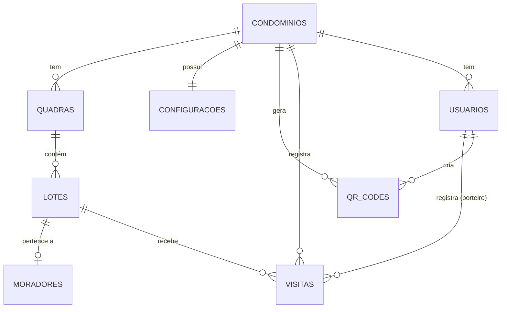

# Esquema de Banco de Dados — SERMIL MAPS

> Baseado na análise dos módulos Admin e Porteiro. Módulo Visitante ignorado conforme solicitado.

---

## Diagrama de Entidades



---

## Tabelas

---

### 🏢 `condominios`
Entidade raiz do sistema. Tudo pertence a um condomínio.

| Coluna           | Tipo          | Restrições              | Descrição                          |
|------------------|---------------|-------------------------|------------------------------------|
| `id`             | `SERIAL`      | `PRIMARY KEY`           | ID único                           |
| `nome`           | `VARCHAR(150)` | `NOT NULL`             | Nome do condomínio                 |
| `cidade`         | `VARCHAR(100)` | `NOT NULL`             | Cidade                             |
| `ramal_portaria` | `VARCHAR(20)` | `NOT NULL`              | Ramal principal da portaria        |
| `criado_em`      | `TIMESTAMPTZ` | `DEFAULT NOW()`         | Data de cadastro                   |

---

### ⚙️ `configuracoes`
Preferências do sistema por condomínio. Relação 1:1.

| Coluna                       | Tipo        | Restrições              | Descrição                                   |
|------------------------------|-------------|-------------------------|---------------------------------------------|
| `id`                         | `SERIAL`    | `PRIMARY KEY`           |                                             |
| `cond_id`                    | `INTEGER`   | `FK → condominios.id`   | Condomínio ao qual pertence                 |
| `tempo_maximo_visita`        | `INTEGER`   | `NOT NULL, DEFAULT 60`  | Duração máxima de visita (em minutos)       |
| `mapa_interno_ativo`         | `BOOLEAN`   | `DEFAULT TRUE`          | Habilitar mapa interno ao visitante         |
| `google_maps_ativo`          | `BOOLEAN`   | `DEFAULT TRUE`          | Habilitar botão Google Maps                 |
| `waze_ativo`                 | `BOOLEAN`   | `DEFAULT TRUE`          | Habilitar botão Waze                        |
| `ramal_flutuante_ativo`      | `BOOLEAN`   | `DEFAULT TRUE`          | Exibir botão de ramal flutuante             |
| `expiracao_automatica_ativa` | `BOOLEAN`   | `DEFAULT TRUE`          | Expirar visitas automaticamente pelo cron   |

---

### 🗺️ `quadras`
Setores geográficos do condomínio.

| Coluna    | Tipo          | Restrições              | Descrição           |
|-----------|---------------|-------------------------|---------------------|
| `id`      | `SERIAL`      | `PRIMARY KEY`           |                     |
| `cond_id` | `INTEGER`     | `FK → condominios.id`   | Condomínio pai      |
| `nome`    | `VARCHAR(20)` | `NOT NULL`              | Ex: "A", "B", "001" |

**Índice:** `(cond_id, nome)` — UNIQUE

---

### 🏠 `lotes`
Unidades habitacionais dentro de uma quadra.

| Coluna         | Tipo            | Restrições            | Descrição                            |
|----------------|-----------------|-----------------------|--------------------------------------|
| `id`           | `SERIAL`        | `PRIMARY KEY`         |                                      |
| `quadra_id`    | `INTEGER`       | `FK → quadras.id`     | Quadra a qual pertence               |
| `numero`       | `VARCHAR(20)`   | `NOT NULL`            | Número do lote Ex: "12", "4A"        |
| `nome_morador` | `VARCHAR(150)`  | `NULLABLE`            | Nome do proprietário / morador       |
| `ramal`        | `VARCHAR(20)`   | `NULLABLE`            | Ramal de comunicação interno         |
| `latitude`     | `DECIMAL(10,7)` | `NULLABLE`            | Coordenada para navegação no mapa    |
| `longitude`    | `DECIMAL(10,7)` | `NULLABLE`            | Coordenada para navegação no mapa    |

**Índice:** `(quadra_id, numero)` — UNIQUE

> **Nota de Design:** `nome_morador` e `ramal` estão desnormalizados diretamente no lote para simplificar o fluxo de navegação do visitante. Uma tabela separada `moradores` pode ser adicionada no futuro se um lote precisar ter múltiplos moradores cadastrados com dados de autenticação.

---

### 👤 `moradores`
View / tabela derivada para listagem no painel admin. Atualmente é uma view sobre `lotes`.

| Coluna          | Tipo          | Restrições        | Descrição                                     |
|-----------------|---------------|-------------------|-----------------------------------------------|
| `id`            | `SERIAL`      | `PRIMARY KEY`     |                                               |
| `lote_id`       | `INTEGER`     | `FK → lotes.id`   | Lote vinculado                                |
| `nome`          | `VARCHAR(150)` | `NOT NULL`       | Nome completo do morador                      |
| `total_visitas` | `INTEGER`     | `DEFAULT 0`       | Contador desnormalizado (atualizado por trigger) |

> **Alternativa:** Implementar como `VIEW` calculada em cima de `lotes + visitas`, sem tabela física.

---

### 🧑‍💼 `usuarios`
Contas de acesso ao sistema (admin e porteiros).

| Coluna      | Tipo          | Restrições              | Descrição                              |
|-------------|---------------|-------------------------|----------------------------------------|
| `id`        | `SERIAL`      | `PRIMARY KEY`           |                                        |
| `cond_id`   | `INTEGER`     | `FK → condominios.id`   | Condomínio ao qual pertence            |
| `nome`      | `VARCHAR(150)` | `NOT NULL`             | Nome completo                          |
| `email`     | `VARCHAR(255)` | `NOT NULL, UNIQUE`     | Login (email)                          |
| `senha_hash`| `VARCHAR(255)` | `NOT NULL`             | Senha bcrypt                           |
| `role`      | `VARCHAR(20)` | `NOT NULL`              | `'admin'` ou `'porteiro'`              |
| `ativo`     | `BOOLEAN`     | `DEFAULT TRUE`          | Conta ativa/desativada                 |
| `criado_em` | `TIMESTAMPTZ` | `DEFAULT NOW()`         |                                        |

---

### 🚶 `visitas`
Registro de cada acesso ao condomínio.

| Coluna             | Tipo            | Restrições            | Descrição                                        |
|--------------------|-----------------|-----------------------|--------------------------------------------------|
| `id`               | `SERIAL`        | `PRIMARY KEY`         |                                                  |
| `cond_id`          | `INTEGER`       | `FK → condominios.id` | Condomínio                                       |
| `lote_id`          | `INTEGER`       | `FK → lotes.id`       | Destino da visita                                |
| `cpf`              | `VARCHAR(14)`   | `NOT NULL`            | CPF do visitante (formato `000.000.000-00`)      |
| `quadra`           | `VARCHAR(20)`   | `NOT NULL`            | Desnormalizado para histórico (evita JOIN)       |
| `lote`             | `VARCHAR(20)`   | `NOT NULL`            | Desnormalizado para histórico (evita JOIN)       |
| `horario_entrada`  | `TIMESTAMPTZ`   | `NOT NULL`            | Momento do check-in                             |
| `horario_saida`    | `TIMESTAMPTZ`   | `NULLABLE`            | Momento do check-out                            |
| `duracao_minutos`  | `INTEGER`       | `NULLABLE`            | Calculado ao encerrar: `(saida - entrada)`       |
| `app_navegacao`    | `VARCHAR(30)`   | `DEFAULT 'interno'`   | `'interno'`, `'gmaps'`, `'waze'`, `'manual'`     |
| `status`           | `VARCHAR(20)`   | `NOT NULL`            | `'ativa'`, `'encerrada'`, `'expirada'`           |
| `rota`             | `JSONB`         | `NULLABLE`            | Metadados da rota (ex: `{ "tipo": "gmaps" }`)    |
| `observacoes`      | `TEXT`          | `NULLABLE`            | Anotação do porteiro                             |
| `registrado_por`   | `INTEGER`       | `FK → usuarios.id`    | Porteiro que fez registro manual (NULLABLE)      |
| `criado_em`        | `TIMESTAMPTZ`   | `DEFAULT NOW()`       |                                                  |

**Índices:**
- `(cond_id, status)` — para o painel de visitantes ativos
- `(cpf, cond_id)` — para busca no histórico
- `(lote_id, horario_entrada)` — para histórico por lote
- `(horario_entrada)` — para filtros de data

---

### 📱 `qr_codes`
QR Codes de portão gerados pelos administradores.

| Coluna          | Tipo          | Restrições              | Descrição                                         |
|-----------------|---------------|-------------------------|---------------------------------------------------|
| `id`            | `SERIAL`      | `PRIMARY KEY`           |                                                   |
| `cond_id`       | `INTEGER`     | `FK → condominios.id`   | Condomínio                                        |
| `criado_por`    | `INTEGER`     | `FK → usuarios.id`      | Admin que gerou                                   |
| `nome_portao`   | `VARCHAR(100)` | `NOT NULL`             | Label descritivo. Ex: "Portão Principal"           |
| `token`         | `VARCHAR(64)` | `NOT NULL, UNIQUE`      | UUID/hash seguro codificado na URL do QR           |
| `url`           | `TEXT`        | `NOT NULL`              | URL completa gerada                               |
| `ativo`         | `BOOLEAN`     | `DEFAULT TRUE`          | Se pode ser usado                                 |
| `uso_unico`     | `BOOLEAN`     | `DEFAULT FALSE`         | Revogado automaticamente após 1 scan              |
| `usos`          | `INTEGER`     | `DEFAULT 0`             | Contador de scans realizados                      |
| `expira_em`     | `TIMESTAMPTZ` | `NULLABLE`              | Expiração por data/hora (`NULL` = permanente)     |
| `criado_em`     | `TIMESTAMPTZ` | `DEFAULT NOW()`         |                                                   |

**Índice:** `(token)` — para lookup na validação do scan

---

## SQL de Criação (PostgreSQL)

```sql
-- Condominios
CREATE TABLE condominios (
  id              SERIAL PRIMARY KEY,
  nome            VARCHAR(150) NOT NULL,
  cidade          VARCHAR(100) NOT NULL,
  ramal_portaria  VARCHAR(20)  NOT NULL,
  criado_em       TIMESTAMPTZ  DEFAULT NOW()
);

-- Configurações (1:1 com condomínio)
CREATE TABLE configuracoes (
  id                          SERIAL PRIMARY KEY,
  cond_id                     INTEGER NOT NULL REFERENCES condominios(id) ON DELETE CASCADE,
  tempo_maximo_visita         INTEGER NOT NULL DEFAULT 60,
  mapa_interno_ativo          BOOLEAN NOT NULL DEFAULT TRUE,
  google_maps_ativo           BOOLEAN NOT NULL DEFAULT TRUE,
  waze_ativo                  BOOLEAN NOT NULL DEFAULT TRUE,
  ramal_flutuante_ativo       BOOLEAN NOT NULL DEFAULT TRUE,
  expiracao_automatica_ativa  BOOLEAN NOT NULL DEFAULT TRUE,
  UNIQUE (cond_id)
);

-- Quadras
CREATE TABLE quadras (
  id       SERIAL PRIMARY KEY,
  cond_id  INTEGER NOT NULL REFERENCES condominios(id) ON DELETE CASCADE,
  nome     VARCHAR(20) NOT NULL,
  UNIQUE   (cond_id, nome)
);

-- Lotes
CREATE TABLE lotes (
  id           SERIAL PRIMARY KEY,
  quadra_id    INTEGER          NOT NULL REFERENCES quadras(id) ON DELETE CASCADE,
  numero       VARCHAR(20)      NOT NULL,
  nome_morador VARCHAR(150),
  ramal        VARCHAR(20),
  latitude     DECIMAL(10, 7),
  longitude    DECIMAL(10, 7),
  UNIQUE       (quadra_id, numero)
);

-- Usuários
CREATE TABLE usuarios (
  id          SERIAL PRIMARY KEY,
  cond_id     INTEGER      NOT NULL REFERENCES condominios(id) ON DELETE CASCADE,
  nome        VARCHAR(150) NOT NULL,
  email       VARCHAR(255) NOT NULL UNIQUE,
  senha_hash  VARCHAR(255) NOT NULL,
  role        VARCHAR(20)  NOT NULL CHECK (role IN ('admin', 'porteiro')),
  ativo       BOOLEAN      NOT NULL DEFAULT TRUE,
  criado_em   TIMESTAMPTZ  DEFAULT NOW()
);

-- Visitas
CREATE TABLE visitas (
  id               SERIAL PRIMARY KEY,
  cond_id          INTEGER      NOT NULL REFERENCES condominios(id),
  lote_id          INTEGER      NOT NULL REFERENCES lotes(id),
  cpf              VARCHAR(14)  NOT NULL,
  quadra           VARCHAR(20)  NOT NULL,
  lote             VARCHAR(20)  NOT NULL,
  horario_entrada  TIMESTAMPTZ  NOT NULL DEFAULT NOW(),
  horario_saida    TIMESTAMPTZ,
  duracao_minutos  INTEGER,
  app_navegacao    VARCHAR(30)  NOT NULL DEFAULT 'interno',
  status           VARCHAR(20)  NOT NULL DEFAULT 'ativa' CHECK (status IN ('ativa', 'encerrada', 'expirada')),
  rota             JSONB,
  observacoes      TEXT,
  registrado_por   INTEGER REFERENCES usuarios(id),
  criado_em        TIMESTAMPTZ  DEFAULT NOW()
);

CREATE INDEX idx_visitas_status    ON visitas (cond_id, status);
CREATE INDEX idx_visitas_cpf       ON visitas (cpf, cond_id);
CREATE INDEX idx_visitas_lote      ON visitas (lote_id, horario_entrada DESC);
CREATE INDEX idx_visitas_data      ON visitas (horario_entrada DESC);

-- QR Codes
CREATE TABLE qr_codes (
  id           SERIAL PRIMARY KEY,
  cond_id      INTEGER      NOT NULL REFERENCES condominios(id) ON DELETE CASCADE,
  criado_por   INTEGER      REFERENCES usuarios(id),
  nome_portao  VARCHAR(100) NOT NULL,
  token        VARCHAR(64)  NOT NULL UNIQUE,
  url          TEXT         NOT NULL,
  ativo        BOOLEAN      NOT NULL DEFAULT TRUE,
  uso_unico    BOOLEAN      NOT NULL DEFAULT FALSE,
  usos         INTEGER      NOT NULL DEFAULT 0,
  expira_em    TIMESTAMPTZ,
  criado_em    TIMESTAMPTZ  DEFAULT NOW()
);

CREATE INDEX idx_qr_token ON qr_codes (token);
```

---

## Triggers Recomendados

```sql
-- Calcula duração automaticamente ao encerrar visita
CREATE OR REPLACE FUNCTION calcular_duracao_visita()
RETURNS TRIGGER AS $$
BEGIN
  IF NEW.horario_saida IS NOT NULL AND OLD.horario_saida IS NULL THEN
    NEW.duracao_minutos := EXTRACT(EPOCH FROM (NEW.horario_saida - NEW.horario_entrada)) / 60;
  END IF;
  RETURN NEW;
END;
$$ LANGUAGE plpgsql;

CREATE TRIGGER trg_calcular_duracao
  BEFORE UPDATE ON visitas
  FOR EACH ROW EXECUTE FUNCTION calcular_duracao_visita();

-- Revoga QR Code de uso único após o primeiro scan
CREATE OR REPLACE FUNCTION revogar_uso_unico()
RETURNS TRIGGER AS $$
BEGIN
  IF NEW.usos >= 1 AND NEW.uso_unico = TRUE THEN
    NEW.ativo := FALSE;
  END IF;
  RETURN NEW;
END;
$$ LANGUAGE plpgsql;

CREATE TRIGGER trg_uso_unico_qr
  BEFORE UPDATE ON qr_codes
  FOR EACH ROW EXECUTE FUNCTION revogar_uso_unico();
```

---

## Notas de Arquitetura

| Decisão | Justificativa |
|---------|---------------|
| `quadra` e `lote` desnormalizados em `visitas` | Preserva o histórico mesmo que o lote seja renomeado futuramente |
| `token` separado de `url` em `qr_codes` | Permite trocar o domínio base sem invalidar os tokens |
| `JSONB` para `rota` em visitas | Flexível para armazenar metadados diferentes por tipo de rota |
| `configuracoes` como tabela separada | Facilita extensão de preferências sem alterar `condominios` |
| `registrado_por` nullable em `visitas` | Visitas do próprio visitante (self-service via QR) não têm porteiro associado |
